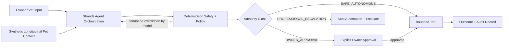

# Architecture

Authority path:

`observe -> classify -> propose -> authorize -> act -> record -> evaluate`

Strands owns orchestration, not safety authority. Deterministic application policy decides whether an action is safe, requires approval, or must stop and escalate.
